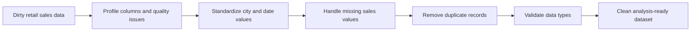

# Retail Sales Data Cleaning Pipeline with Pandas

A Jupyter Notebook project that transforms a deliberately messy retail-sales dataset into a cleaner, analysis-ready table using Python and Pandas.

## Project Goal

The notebook demonstrates a practical data-preparation workflow for common quality problems: inconsistent categorical values, missing sales values, duplicated records, inconsistent date formats, and incorrect column data types.

## Cleaning Workflow



The notebook currently demonstrates the following transformations:

1. Standardizes city names, for example converting `cairo` to `Cairo`.
2. Removes duplicate rows.
3. Handles missing sales values with mean imputation.
4. Converts dates to the `YYYY-MM-DD` format.
5. Validates the resulting column data types.

## Technology Stack

- Python
- Pandas
- Jupyter Notebook

## Repository Contents

```text
Retail store sales dirty for cleaning.ipynb
README.md
```

## Run Locally

```bash
git clone https://github.com/Fatoomnoour/Data-Cleaning-Preprocessing-Pipeline-using-Pandas.git
cd Data-Cleaning-Preprocessing-Pipeline-using-Pandas
python3 -m venv .venv
source .venv/bin/activate
pip install pandas notebook
jupyter notebook
```

Open `Retail store sales dirty for cleaning.ipynb` and run the notebook from top to bottom. The notebook generates the cleaned dataset in the notebook environment; the exact output path should be added here if the project later exports a committed CSV or Parquet artifact.

## Data Quality Notes

Mean imputation is included as a simple demonstration and may not be the best choice for every business dataset. In a production pipeline, the imputation rule should be justified, recorded as metadata, and validated against the business meaning of the field. The cleaning workflow should also report row counts and null counts before and after every major transformation.

## Limitations and Next Improvements

The project is notebook-based and does not yet provide a parameterized command-line pipeline, automated data-quality tests, schema validation, logging, or a reproducible input/output directory contract. Useful next steps include adding Pandera or Great Expectations checks, exporting a clean dataset, adding before/after quality metrics, and packaging the transformations into reusable Python functions.

## Author

**Fatma Nour** — [GitHub](https://github.com/Fatoomnoour)
